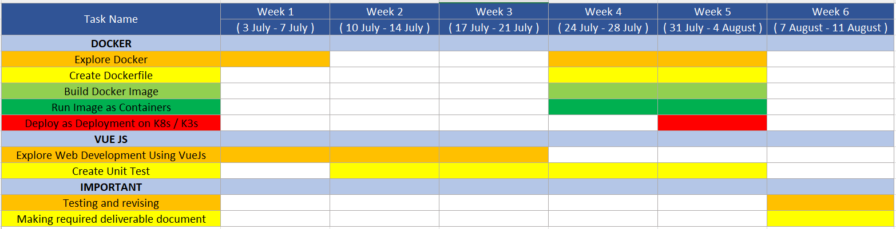
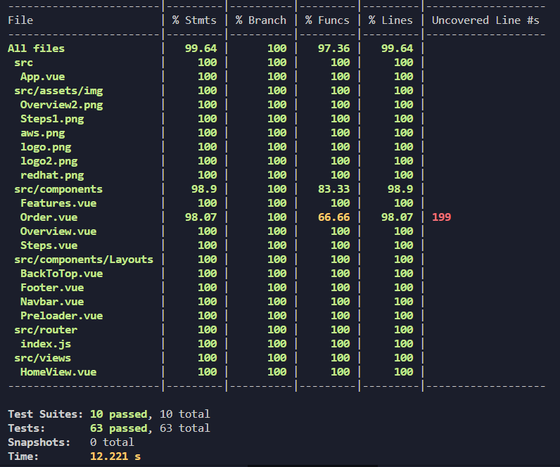

# Playcourt Landing Page (Node Js v16.16.0)

Project task from Telkom Indonesia (Digital Infrastructure & Security)


## Overview

[PlayCourt](https://playcourt.id/) is a Platform as a Service (PaaS) serving as the Digital Infrastructure at the Digital Service Division of PT Telekomunikasi Indonesia. PlayCourt is a comprehensive application development platform specifically designed for the development of Telkom Indonesia's digital products.

## Project Plan



## Run as NodeJs

Install dependencies, devDependencies, etc
```sh
npm install
```

Compiles and hot-reloads for development
```sh
npm run serve
```

Compile and Minify for Production
```sh
npm run build
```

Lint with [ESLint](https://eslint.org/)
```sh
npm run lint
```

## Run as Docker

Build image docker
```sh
docker build -t playcourt .
```

Run container docker    
```sh
docker run -p 8080:80 -it --name playcourt playcourt
```

## Testing Unit

Run unit test component
```sh
npm run test:unit
```

Run unit test with coverage
```sh
npm run coverage
```

Output of Unit testing:



## Deployment

### Netlify

You can see link deploy with Netlify (NodeJs) in [here](https://playcourt.netlify.app/)

### Google Kubernetes Engine

How to deploy on [Google Kubernetes Engine](https://github.com/hibrizys/landing-page-playcourt/blob/main/k8s/deploy.md)

