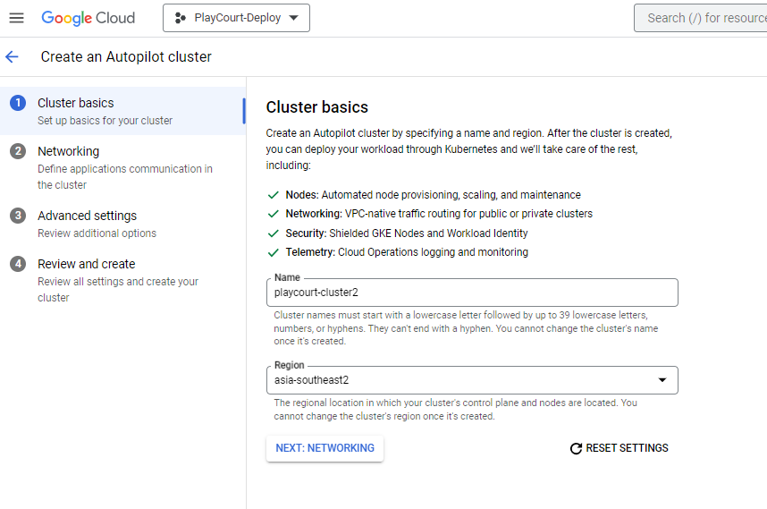
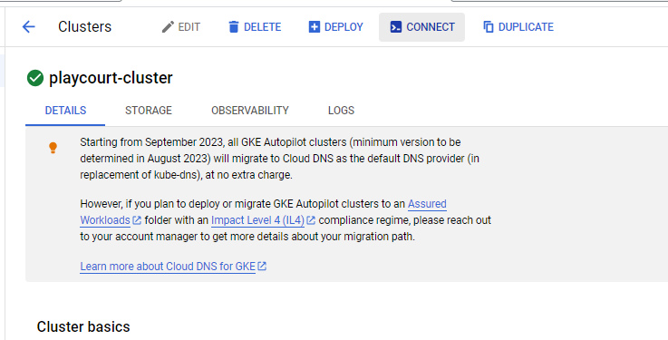
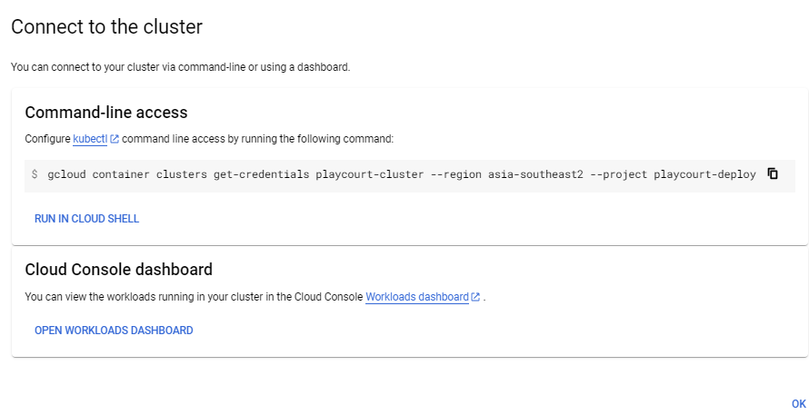
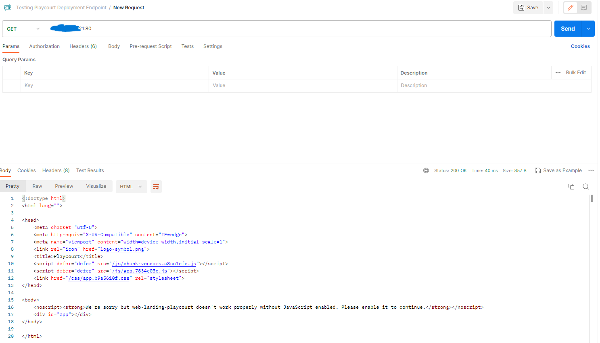
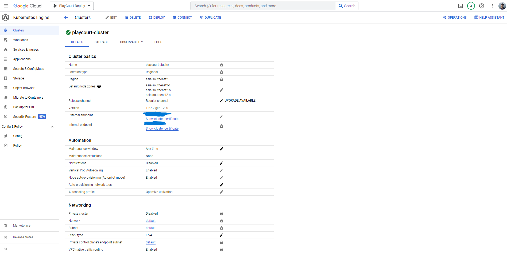

# How to Deploy on Google Kubernetes Engine

- Make sure u've make dockerfile on ur project.

- create repository on [Docker Hub](https://hub.docker.com/) to push image or u can use my [Repository](https://hub.docker.com/repositories/hibrizys)

- make sure your docker are login
```sh
docker login
```

- build the image docker with our repository name on docker hub:
```sh
docker build -t hibrizy/playcourt .
```

- then push the image docker to our repository on docker hub:
```sh
docker push hibrizys/playcourt
```

- go to deployment.yaml and service.yaml path and deploy our application locally
```sh
kubectl create -f .
```

- you can see the deployment running on
```sh
kubectl get pods
```

- u can see the logs too
```sh
kubectl logs <name_pods>
```
- u can get the local endpoint service by
```sh
kubectl get service
```

- if u want to test local endpoint service on postman u must change the service.yaml file on type with "NodePort"
```sh
localhost:<yourport>
```

- go to GCP and make project


- go to Google Kubernetes Engine and create Cluster

- Create with GKE AutoPilot and name the cluster

- set the region to Asia-Southeast2 (Jakarta) and for the networking set to public cluster



- create the cluster

- click the cluster that u've made it, and go to connect



- connect the cluster on your terminal local



- to check our new namespaces got to 
```sh
kubectl get namespaces
```

- change the service.yaml file and type into "LoadBalancer" back

- and create the deployment and service again by
```sh
kubectl create -f .
```

- check the pods if its running
```sh
kubectl get pods
```

- check the new services that connect into google kubernetes engine
```sh
kubectl get svc
```

Wallaa!! the external IP is there

- if u want to check the External IP endpoint on postman again just
```sh
<yourExternalIP>:<yourport>
```

## Output

- Postman External IP



- Google Kubernetes Engine Configuration

